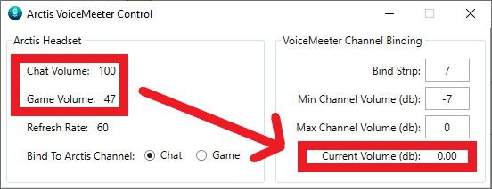
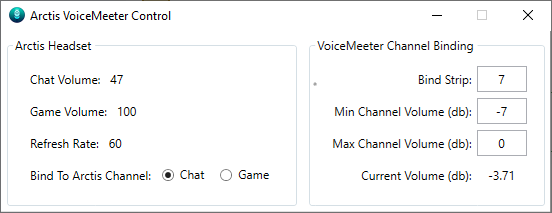

# ArctisVoiceMeeter
Binds the ChatMix knob of an Arctis headset to the Gain slider of a VoiceMeeter channel.

Uses the USB Transmitter, not Bluetooth.

## Requirements
SteelSeries Arctis 9 Headset (support for other Arctis headsets should be easy to add)

VoiceMeeter installed and Set Up

## Usage 
Just run with the Arctis transmitter connected.

Goes to System Tray when minimized.

## Attributions
The works of the following creators were used in the making of this app:

[@A-tG](https://github.com/A-tG): https://github.com/A-tG/Voicemeeter-Remote-API-dll-dynamic-wrapper

[@crazyklatsch](https://github.com/crazyklatsch): https://github.com/crazyklatsch/Arctis7_BatteryReader

[@Sapd](https://github.com/Sapd): https://github.com/Sapd/HeadsetControl

